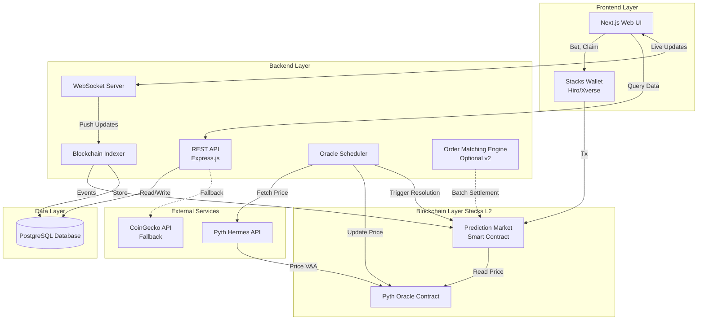
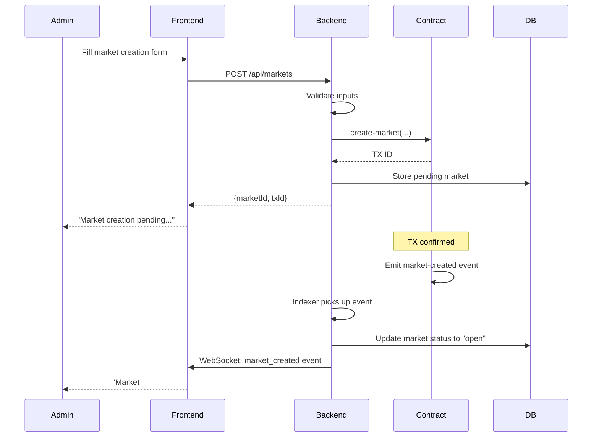
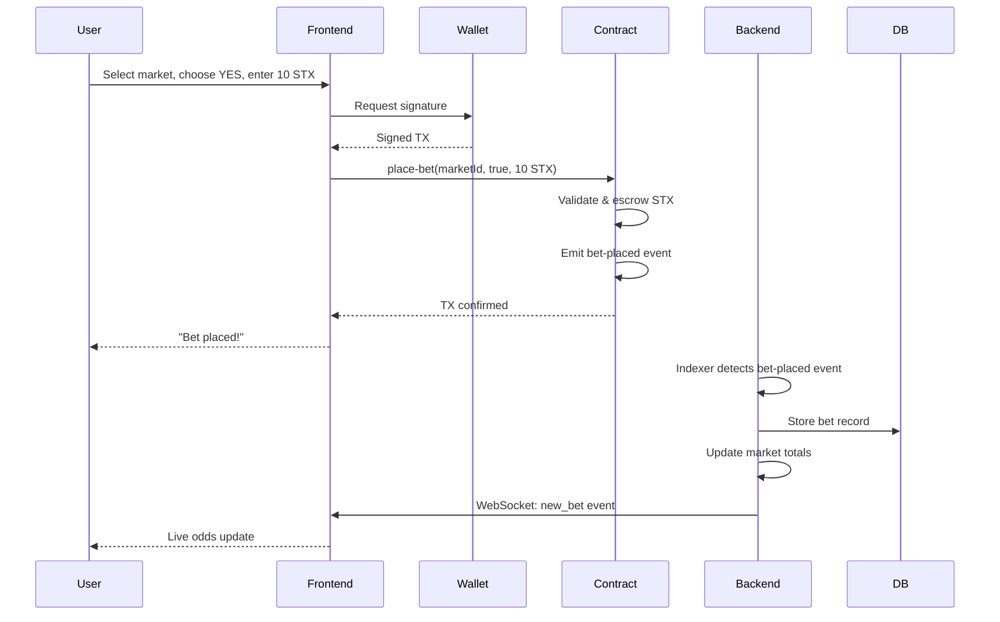
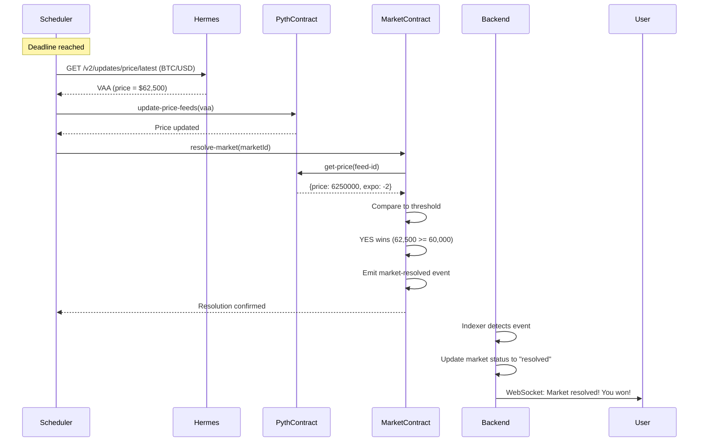
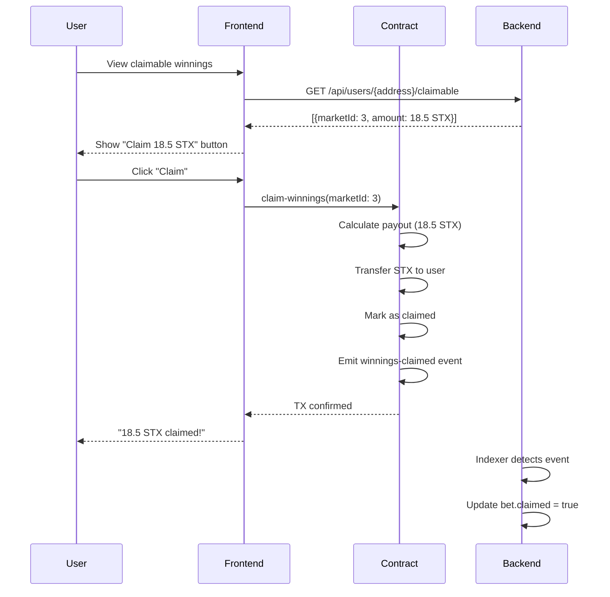
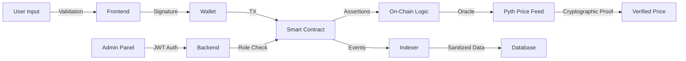

# Project Architecture Overview

## System Components

This document provides a high-level overview of the entire prediction market system architecture on Stacks L2.



---

## Component Descriptions

### Frontend (Next.js)

- **Purpose**: User interface for browsing markets, placing bets, and claiming winnings
- **Tech Stack**: Next.js 14, React, TailwindCSS, Stacks.js
- **Key Features**:
  - Market browsing and filtering
  - Real-time odds display
  - Wallet connection (Hiro, Xverse)
  - Betting interface
  - User dashboard (active bets, claimable winnings)
  - Admin panel (market creation, cancellation)

### Backend Services

- **REST API**: Provides market data, user stats, and admin functions
- **WebSocket Server**: Real-time updates for odds, new bets, resolutions
- **Blockchain Indexer**: Listens to on-chain events and stores in database
- **Oracle Scheduler**: Monitors deadlines and triggers automatic resolution
- **Order Matching Engine** (v2): Off-chain order book for advanced trading

### Smart Contracts (Clarity)

- **Prediction Market Contract**: Core logic for markets, bets, resolution, payouts
- **Pyth Oracle Contract**: Provides verifiable price feeds

### Database (PostgreSQL)

- **Schema**: Markets, bets, users, oracle prices, fees
- **Purpose**: Fast queries, historical data, analytics

### External Services

- **Pyth Hermes API**: Primary oracle price source
- **CoinGecko/Binance**: Fallback price sources

---

## Data Flow Examples

### Creating a Market



---

### Placing a Bet



---

### Automatic Market Resolution



---

### Claiming Winnings



---

## Technology Stack Summary

| Component              | Technology                                           | Reasoning                                |
| ---------------------- | ---------------------------------------------------- | ---------------------------------------- |
| **Smart Contracts**    | Clarity                                              | Native to Stacks, decidable, secure      |
| **Blockchain**         | Stacks L2                                            | Bitcoin-secured L2, low fees             |
| **Oracle**             | Pyth Network                                         | Real-time prices, 400+ feeds, verifiable |
| **Backend**            | Node.js + TypeScript                                 | Fast, scalable, large ecosystem          |
| **API Framework**      | Express.js / Fastify                                 | Mature, well-documented                  |
| **Database**           | PostgreSQL + Prisma                                  | Reliable, ACID, ORM for type safety      |
| **Frontend**           | Next.js 14 (App Router)                              | SSR, SEO, performance                    |
| **Styling**            | Vanilla CSS (custom design system)                   | Maximum control, modern aesthetics       |
| **Wallet Integration** | Stacks.js + Connect                                  | Official Stacks wallet libraries         |
| **Real-Time**          | WebSocket (Socket.io)                                | Live updates for bets and odds           |
| **Deployment**         | Docker + Railway/Vercel                              | Scalable, automated                      |
| **Testing**            | Clarinet (Clarity), Jest (Backend), Playwright (E2E) | Comprehensive coverage                   |

---

## Deployment Architecture

### Development

```
Local Machine
├── Clarinet (local devnet)
├── PostgreSQL (Docker)
├── Backend (localhost:3001)
└── Frontend (localhost:3000)
```

### Staging (Testnet)

```
Vercel (Frontend)
Railway/AWS (Backend + PostgreSQL)
Stacks Testnet (Contracts)
```

### Production (Mainnet)

```
Vercel Edge Network (Frontend)
AWS/Railway (Backend)
  ├── EC2/Container (API + WebSocket)
  ├── RDS PostgreSQL (Database)
  └── CloudWatch (Monitoring)
Stacks Mainnet (Contracts)
Pyth Hermes (Oracle)
```

---

## Security Layers



**Security Measures**:

1. **Frontend**: Input sanitization, XSS protection
2. **Wallet**: User signature for all transactions
3. **Smart Contract**: Access control (admin checks), input validation, state machine guards
4. **Oracle**: Cryptographic VAAs, staleness checks, fallback mechanisms
5. **Backend**: JWT authentication, rate limiting, SQL injection prevention
6. **Database**: Encrypted at rest, read replicas for queries

---

## Scalability Considerations

### On-Chain

- **Minimize writes**: Store only essential data on-chain
- **Batch operations**: Future enhancement for multiple bets in one TX
- **Read-only functions**: Free queries for UI

### Off-Chain

- **Order matching** (v2): Handle order book logic off-chain, settle batch on-chain
- **Caching**: Redis for frequently accessed data (market odds, user stats)
- **CDN**: Static assets on Vercel Edge
- **Database indexing**: On `marketId`, `userAddress`, `status`

### Hybrid Approach

Similar to Polymarket:

- **Off-chain**: Order book, matching, market data aggregation
- **On-chain**: Final settlement, escrow, oracle resolution

This achieves **1000x improvement** in throughput vs pure on-chain.

---

## Monitoring & Observability

```
Sentry (Error Tracking)
  ├── Frontend errors
  └── Backend exceptions

Datadog / CloudWatch (Metrics)
  ├── API latency
  ├── WebSocket connections
  ├── Database query performance
  └── Contract gas usage

Custom Dashboards
  ├── Active markets
  ├── Total volume (24h, 7d, all-time)
  ├── User growth
  ├── Fee revenue
  └── Oracle health status
```

---

## Future Enhancements (Roadmap)

### Phase 1 (MVP) - Q1 2025

- ✅ Core smart contracts
- ✅ Basic backend API
- ✅ Simple betting UI
- ✅ Pyth oracle integration
- ✅ Admin panel

### Phase 2 (Advanced Features) - Q2 2025

- [ ] Order matching engine (limit orders)
- [ ] Liquidity pools
- [ ] Platform governance token
- [ ] Fee sharing with LPs
- [ ] Mobile app (React Native)

### Phase 3 (Scale) - Q3 2025

- [ ] Multi-asset markets (correlations, spreads)
- [ ] Parlay bets (multiple outcomes)
- [ ] Chainlink integration (backup oracle)
- [ ] L1 Bitcoin settlement (via sBTC)
- [ ] DAO governance

---

This architecture provides a robust, scalable foundation for a trustless prediction market on Stacks L2.
