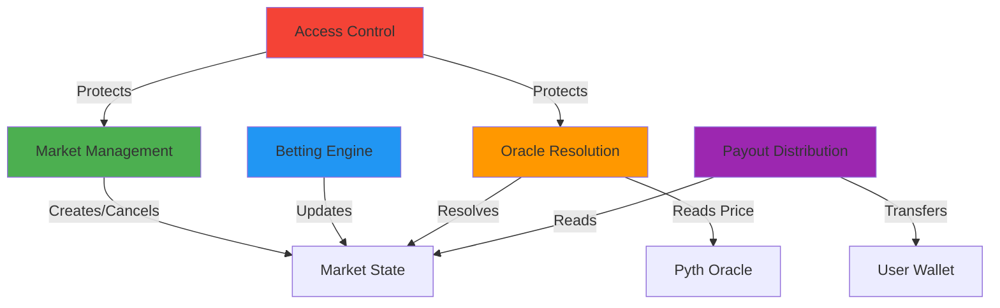
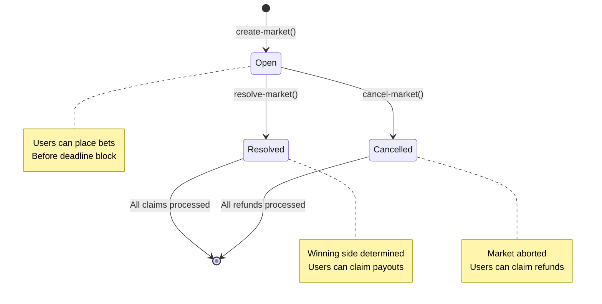

# Smart Contract Technical Specification

## Architecture Overview

The prediction market smart contract follows a **modular architecture** with clear separation of concerns. Each module has a single responsibility, reducing coupling and improving maintainability. This aligns with Clarity's decidable nature and makes the contract predictable and testable.

### Core Modules



1. **Market Management**: Handles market creation, cancellation, and metadata storage
2. **Betting Engine**: Manages bet placement, stake tracking, and pool totals
3. **Oracle Resolution**: Interfaces with Pyth price feeds and determines outcomes
4. **Payout Distribution**: Calculates and distributes winnings to users
5. **Access Control**: Enforces admin permissions and role management

---

## Data Structures

### State Variables

#### Global State

```clarity
;; Auto-incrementing market counter
(define-data-var market-count uint u0)

;; Protocol fee percentage (in basis points: 200 = 2%)
(define-data-var protocol-fee-bps uint u200)

;; Protocol fee treasury
(define-data-var fee-treasury uint u0)
```

#### Maps

##### Markets Map

```clarity
(define-map markets
  uint  ;; market-id
  {
    question: (string-utf8 500),
    asset: principal,           ;; Asset to track (e.g., BTC/USD feed contract)
    threshold: uint,            ;; Price threshold in cents (e.g., 6000000 = $60,000.00)
    deadline: uint,             ;; Block height when betting closes
    created-at: uint,           ;; Block height when market was created
    status: (string-ascii 20),  ;; "open", "resolved", "cancelled"
    winning-side: (optional bool), ;; true = YES won, false = NO won, none = unresolved
    creator: principal          ;; Admin who created the market
  }
)
```

##### Market Totals Map

Tracks aggregate bet amounts for each side of a market.

```clarity
(define-map market-totals
  uint  ;; market-id
  {
    yes-total: uint,
    no-total: uint
  }
)
```

##### User Bets Map

Tracks individual user stakes for each market.

```clarity
(define-map user-bets
  { market-id: uint, user: principal }
  {
    yes-amount: uint,
    no-amount: uint,
    claimed: bool
  }
)
```

##### Admins Map

```clarity
(define-map admins
  principal
  bool
)
```

---

## Market Lifecycle & State Machine



### Status Transitions

| Current Status | Allowed Transition | Function         | Access                  |
| -------------- | ------------------ | ---------------- | ----------------------- |
| (none)         | → `open`           | `create-market`  | Admin only              |
| `open`         | → `resolved`       | `resolve-market` | Public (after deadline) |
| `open`         | → `cancelled`      | `cancel-market`  | Admin only              |
| `resolved`     | No further changes | -                | -                       |
| `cancelled`    | No further changes | -                | -                       |

---

## Function Specifications

### Module 1: Market Management

#### `create-market`

**Access**: Admin only  
**Description**: Creates a new prediction market with specified parameters.

```clarity
(define-public (create-market
    (question (string-utf8 500))
    (asset principal)
    (threshold uint)
    (deadline uint))
  (response uint uint))
```

**Parameters**:

- `question`: Human-readable market question (e.g., "Will BTC be above $60k on Jan 31, 2025?")
- `asset`: Principal of the Pyth price feed contract for this asset
- `threshold`: Price threshold in cents (scaled: 6000000 = $60,000.00)
- `deadline`: Block height when betting closes

**Returns**: `(ok market-id)` on success, `(err u<code>)` on failure

**Validations**:

- Caller is admin
- Question is non-empty and ≤ 500 chars
- Threshold > 0
- Deadline is in the future (> current block height)

**State Changes**:

- Increments `market-count`
- Adds entry to `markets` map
- Initializes `market-totals` with zeros
- Emits `market-created` event

**Errors**:

- `u1`: Not authorized (not admin)
- `u2`: Invalid question
- `u3`: Invalid threshold
- `u4`: Invalid deadline (must be in future)

---

#### `cancel-market`

**Access**: Admin only  
**Description**: Cancels an unresolved market, allowing users to claim refunds.

```clarity
(define-public (cancel-market (market-id uint))
  (response bool uint))
```

**Parameters**:

- `market-id`: ID of the market to cancel

**Returns**: `(ok true)` on success

**Validations**:

- Caller is admin
- Market exists
- Market status is `open` (not already resolved or cancelled)

**State Changes**:

- Updates `markets` status to `cancelled`
- Emits `market-cancelled` event

**Errors**:

- `u1`: Not authorized
- `u10`: Market not found
- `u11`: Market already resolved or cancelled

---

#### `get-market-info` (read-only)

**Description**: Returns full market information.

```clarity
(define-read-only (get-market-info (market-id uint))
  (response {
    question: (string-utf8 500),
    asset: principal,
    threshold: uint,
    deadline: uint,
    created-at: uint,
    status: (string-ascii 20),
    winning-side: (optional bool),
    yes-total: uint,
    no-total: uint
  } uint))
```

**Returns**: Market data merged with totals, or error if market doesn't exist.

---

### Module 2: Betting Engine

#### `place-bet`

**Access**: Public  
**Description**: Places a bet on YES or NO side of a market. User sends STX with transaction.

```clarity
(define-public (place-bet
    (market-id uint)
    (side bool)  ;; true = YES, false = NO
    (amount uint))
  (response bool uint))
```

**Parameters**:

- `market-id`: Market to bet on
- `side`: `true` for YES, `false` for NO
- `amount`: Amount of STX (in microSTX) to bet

**Returns**: `(ok true)` on success

**Validations**:

- Market exists and status is `open`
- Current block height < deadline
- Amount > 0 and >= minimum bet (e.g., 1 STX)
- User has sufficient STX balance

**State Changes**:

- Transfers `amount` STX from user to contract
- Updates `user-bets` map (increments `yes-amount` or `no-amount`)
- Updates `market-totals` map (increments `yes-total` or `no-total`)
- Emits `bet-placed` event

**Errors**:

- `u10`: Market not found
- `u12`: Market not open for betting
- `u13`: Betting deadline passed
- `u14`: Invalid bet amount (zero or below minimum)
- `u15`: Insufficient balance

**Example Flow**:

```clarity
;; User bets 10 STX on YES for market #1
(contract-call? .prediction-market place-bet u1 true u10000000)
;; Transfers 10 STX to contract
;; Updates user-bets[(1, tx-sender)].yes-amount += 10 STX
;; Updates market-totals[1].yes-total += 10 STX
```

---

#### `get-user-bets` (read-only)

**Description**: Returns a user's bet positions for a specific market.

```clarity
(define-read-only (get-user-bets (market-id uint) (user principal))
  (response {
    yes-amount: uint,
    no-amount: uint,
    claimed: bool
  } uint))
```

---

### Module 3: Oracle Resolution

#### `resolve-market`

**Access**: Public (but only executable after deadline)  
**Description**: Fetches price from Pyth oracle and resolves the market outcome.

```clarity
(define-public (resolve-market (market-id uint))
  (response bool uint))
```

**Parameters**:

- `market-id`: Market to resolve

**Returns**: `(ok true)` on success

**Validations**:

- Market exists and status is `open`
- Current block height >= deadline (deadline has passed)
- Oracle price is available and not stale

**Logic**:

1. Fetch latest price for market's asset from Pyth contract
2. Compare price to threshold:
   - If `price >= threshold` → YES wins (`winning-side = some(true)`)
   - If `price < threshold` → NO wins (`winning-side = some(false)`)
3. Update market status to `resolved`
4. Emit `market-resolved` event with final price and outcome

**State Changes**:

- Updates `markets` map: status = `resolved`, `winning-side` set
- Emits event with resolution details

**Errors**:

- `u10`: Market not found
- `u16`: Deadline not reached yet
- `u17`: Market already resolved
- `u18`: Oracle price unavailable or stale

**Oracle Integration**:

```clarity
;; Example Pyth contract call
(contract-call? .pyth-oracle-v4 get-price (get asset market))
;; Returns: { price: int, expo: int, timestamp: uint }
;; Validate timestamp is recent (e.g., within last 60 seconds)
```

---

#### `override-resolution` (Admin Emergency Function)

**Access**: Admin only  
**Description**: Manually sets market outcome in case of oracle failure.

```clarity
(define-public (override-resolution
    (market-id uint)
    (winning-side bool))
  (response bool uint))
```

**Use Case**: Oracle outage, incorrect price posted, or dispute resolution.

**Validations**:

- Caller is admin
- Market exists and is `open` (not already resolved via normal flow)

**Note**: This is a safety mechanism. In production, consider adding a time-delay or multi-sig requirement.

---

### Module 4: Payout Distribution

#### `calculate-payout` (read-only)

**Description**: Computes the payout amount for a user in a resolved market.

```clarity
(define-read-only (calculate-payout (market-id uint) (user principal))
  (response uint uint))
```

**Returns**: Payout amount in microSTX, or `u0` if user lost or didn't bet.

**Formula**:

```
IF user bet on winning side:
  user_bet = winning_side ? yes_amount : no_amount
  total_winner_bets = winning_side ? yes_total : no_total
  total_loser_bets = winning_side ? no_total : yes_total

  gross_payout = user_bet + (user_bet / total_winner_bets) * total_loser_bets
  protocol_fee = gross_payout * protocol_fee_bps / 10000
  net_payout = gross_payout - protocol_fee

  RETURN net_payout
ELSE:
  RETURN 0
```

**Edge Cases**:

- If no losers (total_loser_bets = 0), winners only get their stake back
- If user bet on both sides, only winning side counts
- Protocol fee is deducted from winnings

---

#### `claim-winnings`

**Access**: Public  
**Description**: Allows a user to withdraw their winnings from a resolved market.

```clarity
(define-public (claim-winnings (market-id uint))
  (response uint uint))
```

**Parameters**:

- `market-id`: Market to claim from

**Returns**: `(ok payout-amount)` on success

**Validations**:

- Market exists and status is `resolved`
- User bet on the winning side
- User has not already claimed (`claimed = false`)
- Payout amount > 0

**State Changes**:

- Transfers payout amount from contract to user
- Updates `fee-treasury` with protocol fee
- Marks `user-bets[(market-id, user)].claimed = true`
- Emits `winnings-claimed` event

**Errors**:

- `u10`: Market not found
- `u19`: Market not resolved yet
- `u20`: User did not win (bet on losing side or didn't bet)
- `u21`: Already claimed
- `u22`: Payout calculation error

---

#### `claim-refund`

**Access**: Public  
**Description**: Allows users to reclaim their stake from a cancelled market.

```clarity
(define-public (claim-refund (market-id uint))
  (response uint uint))
```

**Validations**:

- Market status is `cancelled`
- User has unclaimed bets
- User has not already claimed refund

**Returns**: Total refunded amount (yes_amount + no_amount)

**State Changes**:

- Transfers full stake back to user (no fees on refunds)
- Marks `claimed = true`
- Emits `refund-claimed` event

---

### Module 5: Access Control

#### `add-admin`

**Access**: Admin only  
**Description**: Grants admin privileges to a new address.

```clarity
(define-public (add-admin (new-admin principal))
  (response bool uint))
```

**Validations**:

- Caller is already an admin
- `new-admin` is not already an admin

**State Changes**:

- Sets `admins[new-admin] = true`
- Emits `admin-added` event

---

#### `remove-admin`

**Access**: Admin only  
**Description**: Revokes admin privileges.

```clarity
(define-public (remove-admin (admin principal))
  (response bool uint))
```

**Validations**:

- Caller is admin
- Cannot remove the last remaining admin (safety check)

**State Changes**:

- Sets `admins[admin] = false`
- Emits `admin-removed` event

---

#### `is-admin` (read-only)

```clarity
(define-read-only (is-admin (user principal))
  bool)
```

Returns `true` if user is admin, `false` otherwise.

---

## Events

All state-changing functions emit events for off-chain indexing.

```clarity
;; Market created
(print {
  event: "market-created",
  market-id: market-id,
  question: question,
  threshold: threshold,
  deadline: deadline
})

;; Bet placed
(print {
  event: "bet-placed",
  market-id: market-id,
  user: tx-sender,
  side: side,
  amount: amount
})

;; Market resolved
(print {
  event: "market-resolved",
  market-id: market-id,
  winning-side: winning-side,
  final-price: price
})

;; Winnings claimed
(print {
  event: "winnings-claimed",
  market-id: market-id,
  user: tx-sender,
  amount: payout
})
```

---

## Error Codes Reference

| Code | Constant                     | Description                          |
| ---- | ---------------------------- | ------------------------------------ |
| u1   | ERR_NOT_AUTHORIZED           | Caller is not admin                  |
| u2   | ERR_INVALID_QUESTION         | Question is empty or too long        |
| u3   | ERR_INVALID_THRESHOLD        | Threshold is zero or invalid         |
| u4   | ERR_INVALID_DEADLINE         | Deadline is in the past              |
| u10  | ERR_MARKET_NOT_FOUND         | Market ID doesn't exist              |
| u11  | ERR_MARKET_ALREADY_FINALIZED | Market is resolved or cancelled      |
| u12  | ERR_MARKET_NOT_OPEN          | Market is not in "open" status       |
| u13  | ERR_DEADLINE_PASSED          | Betting deadline has passed          |
| u14  | ERR_INVALID_AMOUNT           | Bet amount is zero or below minimum  |
| u15  | ERR_INSUFFICIENT_BALANCE     | User doesn't have enough STX         |
| u16  | ERR_DEADLINE_NOT_REACHED     | Cannot resolve before deadline       |
| u17  | ERR_ALREADY_RESOLVED         | Market already resolved              |
| u18  | ERR_ORACLE_UNAVAILABLE       | Oracle price is unavailable or stale |
| u19  | ERR_NOT_RESOLVED             | Market not resolved yet              |
| u20  | ERR_NOT_WINNER               | User did not bet on winning side     |
| u21  | ERR_ALREADY_CLAIMED          | User already claimed payout          |
| u22  | ERR_PAYOUT_ERROR             | Error calculating payout             |

---

## Security Considerations

### 1. **Access Control**

- All admin functions check `is-admin` before execution
- Contract deployer is initial admin
- Multi-admin support with minimum 1 admin enforcement

### 2. **Reentrancy Protection**

- Clarity's design prevents reentrancy by default
- No recursive contract calls possible

### 3. **Integer Safety**

- Clarity uses safe math (no overflow/underflow)
- All arithmetic operations are checked

### 4. **Oracle Security**

- Price staleness checks (reject prices older than 60 seconds)
- Fallback admin override for oracle failures
- Multiple oracle support (future: DIA, Chainlink)

### 5. **State Validation**

- All state transitions validated via status checks
- Double-claim prevention via `claimed` flag
- Deadline enforcement for betting and resolution

### 6. **Economic Security**

- Protocol fee prevents zero-sum griefing
- Minimum bet amount to prevent spam
- No early withdrawal (funds locked until resolution)

---

## Gas Optimization Notes

1. **Batch Operations**: Future enhancement to allow multiple bets in one transaction
2. **Read-Only Functions**: Extensive use of `define-read-only` for UI queries (no gas cost)
3. **Minimal Storage**: Small data structures, efficient map keys
4. **Event Indexing**: Heavy lifting done off-chain via event indexer

---

## Testing Strategy

### Unit Tests (Clarinet)

- Test each function in isolation
- Cover all error paths
- Test edge cases (zero amounts, boundary conditions)

### Integration Tests

- Full market lifecycle: create → bet → resolve → claim
- Cancellation flow: create → bet → cancel → refund
- Multi-user scenarios

### Mainnet Simulation (Clarinet Simnet)

- Test with real Pyth price data
- Simulate oracle failures
- Test with realistic STX amounts

---

## Future Enhancements

1. **SIP-010 Token Support**: Allow betting with any SIP-010 token (USDA, etc.)
2. **Order Book Integration**: Support limit orders and off-chain matching
3. **Governance Token**: Platform token for fee rebates and voting
4. **Multi-Asset Markets**: Bet on correlations or spreads between assets
5. **Chainlink Integration**: Add second oracle source when available on Stacks

---

This specification provides a complete technical foundation for implementing the prediction market smart contract in Clarity.
