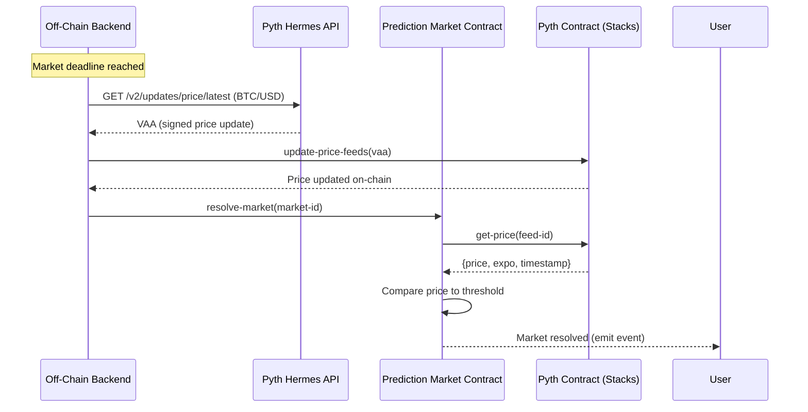

# Pyth Network Integration Guide

## Overview

Pyth Network provides real-time, high-fidelity price feeds for crypto assets on Stacks. It uses a **pull-based oracle model** where developers fetch signed price updates (VAAs - Verifiable Action Approvals) from Pyth's off-chain services and submit them on-chain for verification.

**Key Benefits**:

- **400+ price feeds** including BTC/USD, ETH/USD, SOL/USD
- **Sub-second latency** for price updates
- **Cryptographically verifiable** (signed by Pyth publishers)
- **Fully supported on Stacks** (official integration maintained by Stacks Labs)

**Resources**:

- **Stacks Pyth Docs**: https://docs.stacks.co/more-guides/price-oracles/pyth
- **Pyth Network Docs**: https://docs.pyth.network/
- **Pyth Stacks Integration**: https://www.hiro.so/blog/pyth-price-feeds-now-fully-supported-on-stacks

---

## Architecture



---

## Step 1: Understanding Price Feed IDs

Each asset has a unique **Feed ID** (32-byte identifier).

### Common Feed IDs

| Asset    | Feed ID                                                              |
| -------- | -------------------------------------------------------------------- |
| BTC/USD  | `0xe62df6c8b4a85fe1a67db44dc12de5db330f7ac66b72dc658afedf0f4a415b43` |
| ETH/USD  | `0xff61491a931112ddf1bd8147cd1b641375f79f5825126d665480874634fd0ace` |
| SOL/USD  | `0xef0d8b6fda2ceba41da15d4095d1da392a0d2f8ed0c6c7bc0f4cfac8c280b56d` |
| USDC/USD | `0xeaa020c61cc479712813461ce153894a96a6c00b21ed0cfc2798d1f9a9e9c94a` |

**Full List**: https://pyth.network/developers/price-feed-ids#stacks-mainnet

---

## Step 2: Off-Chain Integration (Backend)

### Install Pyth SDK

```bash
npm install @pythnetwork/hermes-client
```

---

### Fetch Price Updates

```typescript
import { HermesClient } from "@pythnetwork/hermes-client";

const PYTH_HERMES_URL = "https://hermes.pyth.network";
const hermesClient = new HermesClient(PYTH_HERMES_URL);

// BTC/USD feed ID
const BTC_USD_FEED_ID =
  "0xe62df6c8b4a85fe1a67db44dc12de5db330f7ac66b72dc658afedf0f4a415b43";

async function fetchLatestPrice(feedId: string) {
  try {
    // Get latest price update VAA
    const priceUpdates = await hermesClient.getLatestPriceUpdates([feedId]);

    return {
      vaa: priceUpdates.binary.data[0], // Signed price update (hex string)
      price: priceUpdates.parsed[0].price.price,
      expo: priceUpdates.parsed[0].price.expo,
      timestamp: priceUpdates.parsed[0].price.publish_time,
      confidence: priceUpdates.parsed[0].price.conf,
    };
  } catch (error) {
    console.error("Failed to fetch Pyth price:", error);
    throw error;
  }
}

// Example usage
const btcPrice = await fetchLatestPrice(BTC_USD_FEED_ID);
console.log("BTC/USD Price:", btcPrice.price * Math.pow(10, btcPrice.expo));
// Output: 62500.50 (if price = 6250050, expo = -2)
```

---

### Decode Price

Pyth prices use **fixed-point notation**:

```
actual_price = price * 10^expo
```

**Example**:

- `price = 6250050`
- `expo = -2`
- `actual_price = 6250050 * 10^-2 = 62500.50` USD

---

### Submit Price Update to Stacks

```typescript
import { makeContractCall, broadcastTransaction } from "@stacks/transactions";
import { StacksMainnet } from "@stacks/network";

async function updatePythPriceOnChain(vaa: string) {
  const network = new StacksMainnet();

  const txOptions = {
    contractAddress: "SP2T5JKWWP3FYYX4JRG2SB8N7PEQN3YQRQV2QSZHH",
    contractName: "pyth-oracle-v4",
    functionName: "update-price-feeds",
    functionArgs: [bufferCV(Buffer.from(vaa, "hex"))],
    senderKey: process.env.ADMIN_PRIVATE_KEY!,
    network,
    fee: 10000n,
  };

  const transaction = await makeContractCall(txOptions);
  const broadcastResponse = await broadcastTransaction(transaction, network);

  return broadcastResponse.txid;
}
```

---

## Step 3: On-Chain Integration (Clarity)

### Read Price from Pyth Contract

```clarity
;; Pyth contract on Stacks mainnet
(define-constant pyth-contract 'SP2T5JKWWP3FYYX4JRG2SB8N7PEQN3YQRQV2QSZHH.pyth-oracle-v4)

;; BTC/USD feed ID (stored as bytes)
(define-constant btc-usd-feed-id 0xe62df6c8b4a85fe1a67db44dc12de5db330f7ac66b72dc658afedf0f4a415b43)

;; Get latest BTC/USD price
(define-read-only (get-btc-price)
  (contract-call? pyth-contract get-price btc-usd-feed-id))

;; Returns: (ok {price: int, expo: int, timestamp: uint, ...})
```

---

### Market Resolution with Pyth

```clarity
(define-public (resolve-market (market-id uint))
  (let (
    (market (unwrap! (map-get? markets market-id) (err err-market-not-found)))
    (feed-id (get asset market))  ;; Store feed-id as asset identifier
    (threshold (get threshold market))
    (deadline (get deadline market))
  )
    ;; Validate
    (asserts! (is-eq (get status market) "open") (err err-market-not-open))
    (asserts! (>= block-height deadline) (err err-deadline-not-reached))

    ;; Fetch price from Pyth
    (match (contract-call? pyth-contract get-price feed-id)
      success (let (
        (price-data (unwrap! success (err err-oracle-unavailable)))
        (price (get price price-data))
        (expo (get expo price-data))
        (timestamp (get timestamp price-data))

        ;; Convert to same scale as threshold
        ;; Assuming threshold is in cents (e.g., 6000000 = $60,000.00)
        ;; Pyth BTC has expo = -8, so we need to convert
        (adjusted-price (adjust-price price expo))
      )
        ;; Validate price is fresh (within last 60 seconds)
        (asserts! (< (- stacks-block-time timestamp) u60) (err err-stale-price))

        ;; Determine winner: YES if price >= threshold, NO otherwise
        (let ((winning-side (>= adjusted-price threshold)))
          ;; Update market
          (map-set markets market-id (merge market {
            status: "resolved",
            winning-side: (some winning-side),
            final-price: (some adjusted-price)
          }))

          ;; Emit event
          (print {
            event: "market-resolved",
            market-id: market-id,
            winning-side: winning-side,
            final-price: adjusted-price,
            threshold: threshold
          })

          (ok winning-side)))
      )
      error (err err-oracle-unavailable))))
```

---

### Price Adjustment Helper

```clarity
;; Convert Pyth price to cents (2 decimal places)
(define-read-only (adjust-price (price int) (expo int))
  (if (< expo -2)
    ;; Pyth has more decimals, divide
    ;; Example: BTC has expo=-8, we want -2
    ;; So divide by 10^6: price / 1000000
    (/ price (pow u10 (to-uint (- -2 expo))))
    ;; Pyth has same or fewer decimals, multiply
    (if (> expo -2)
      (* price (pow u10 (to-uint (- expo -2))))
      price)))

;; Helper: power function
(define-read-only (pow (base uint) (exp uint))
  (if (is-eq exp u0)
    u1
    (* base (pow base (- exp u1)))))
```

---

## Step 4: Backend Scheduler

Create a service that monitors market deadlines and triggers resolution:

```typescript
import { fetchLatestPrice, updatePythPriceOnChain } from "./pyth";
import { resolveMarket } from "./stacks";

async function monitorMarketDeadlines() {
  // Fetch markets nearing deadline (within next 10 blocks)
  const pendingMarkets = await db.market.findMany({
    where: {
      status: "open",
      deadline: {
        lte: currentBlockHeight + 10,
        gte: currentBlockHeight,
      },
    },
  });

  for (const market of pendingMarkets) {
    if (currentBlockHeight >= market.deadline) {
      await resolveMarketWithPyth(market.id, market.feedId);
    }
  }
}

async function resolveMarketWithPyth(marketId: number, feedId: string) {
  try {
    // 1. Fetch latest price from Pyth Hermes
    const priceUpdate = await fetchLatestPrice(feedId);

    // 2. Submit price update to Pyth contract on Stacks
    console.log(`Updating Pyth price for feed ${feedId}...`);
    const updateTxId = await updatePythPriceOnChain(priceUpdate.vaa);

    // Wait for confirmation (1 block)
    await waitForTransaction(updateTxId);

    // 3. Call resolve-market on our contract
    console.log(`Resolving market ${marketId}...`);
    const resolveTxId = await resolveMarket(marketId);

    console.log(`Market ${marketId} resolved! TX: ${resolveTxId}`);

    // 4. Update database
    await db.market.update({
      where: { id: marketId },
      data: {
        status: "resolved",
        finalPrice: priceUpdate.price,
        resolvedAt: new Date(),
      },
    });
  } catch (error) {
    console.error(`Failed to resolve market ${marketId}:`, error);
    // Alert admin for manual intervention
    await alertAdmin({ marketId, error: error.message });
  }
}

// Run every block (~10 seconds on Stacks)
setInterval(monitorMarketDeadlines, 10_000);
```

---

## Step 5: Price Staleness Protection

**Important**: Always validate that Pyth prices are fresh to prevent manipulation.

### On-Chain Validation

```clarity
(define-constant max-price-age u60)  ;; 60 seconds

(define-read-only (is-price-fresh (price-data (response {... timestamp: uint ...} uint)))
  (match price-data
    success (let ((timestamp (get timestamp success)))
      (< (- stacks-block-time timestamp) max-price-age))
    error false))
```

### Off-Chain Validation

```typescript
function isPriceFresh(timestamp: number, maxAgeSeconds: number = 60): boolean {
  const now = Math.floor(Date.now() / 1000);
  return now - timestamp < maxAgeSeconds;
}

const priceUpdate = await fetchLatestPrice(feedId);
if (!isPriceFresh(priceUpdate.timestamp)) {
  throw new Error("Price is stale");
}
```

---

## Step 6: Fallback Mechanisms

### Multi-Source Oracle

If Pyth fails, fall back to other sources:

```typescript
async function fetchPriceWithFallback(asset: string): Promise<number> {
  try {
    // Primary: Pyth
    const pythPrice = await fetchLatestPrice(FEED_IDS[asset]);
    if (isPriceFresh(pythPrice.timestamp)) {
      return pythPrice.price * Math.pow(10, pythPrice.expo);
    }
  } catch (error) {
    console.warn("Pyth failed, trying fallback...", error);
  }

  try {
    // Fallback 1: CoinGecko
    const cgPrice = await fetchCoinGeckoPrice(asset);
    return cgPrice;
  } catch (error) {
    console.warn("CoinGecko failed, trying Binance...", error);
  }

  try {
    // Fallback 2: Binance
    const binancePrice = await fetchBinancePrice(asset);
    return binancePrice;
  } catch (error) {
    throw new Error("All price sources failed");
  }
}
```

---

### Admin Override

```clarity
(define-public (override-resolution
    (market-id uint)
    (winning-side bool)
    (final-price uint)
    (reason (string-utf8 500)))
  (begin
    (asserts! (is-admin tx-sender) (err err-not-authorized))

    (let ((market (unwrap! (map-get? markets market-id) (err err-market-not-found))))
      (asserts! (is-eq (get status market) "open") (err err-already-resolved))

      ;; Manually set outcome
      (map-set markets market-id (merge market {
        status: "resolved",
        winning-side: (some winning-side),
        final-price: (some final-price)
      }))

      ;; Log reason
      (print {
        event: "admin-override",
        market-id: market-id,
        winning-side: winning-side,
        final-price: final-price,
        reason: reason,
        admin: tx-sender
      })

      (ok true))))
```

---

## Testing with Pyth

### Local Testing (Clarinet)

Use mock price data in tests:

```typescript
// tests/market_resolution_test.ts
Clarinet.test({
  name: "Market resolves correctly with Pyth price",
  async fn(chain: Chain, accounts: Map<string, Account>) {
    // Mock Pyth contract response
    const mockPythPrice = {
      price: 6250000, // $62,500.00
      expo: -2,
      timestamp: 1706745600,
      confidence: 5000,
    };

    // In real test, you'd deploy a mock Pyth contract
    // or use Clarinet's simnet with mainnet data

    let block = chain.mineBlock([
      Tx.contractCall(
        "prediction-market",
        "resolve-market",
        [types.uint(1)],
        deployer.address
      ),
    ]);

    assertEquals(block.receipts[0].result, "(ok true)");
  },
});
```

---

### Testnet Testing

1. Deploy to Stacks testnet
2. Use Pyth testnet endpoint: `https://hermes-beta.pyth.network`
3. Test with real (testnet) price feeds

---

## Cost Considerations

### Gas Costs

- **Update price feeds**: ~5,000 - 10,000 µSTX (negligible)
- **Resolve market** (with Pyth read): ~15,000 - 25,000 µSTX
- **Total cost per resolution**: < $0.01 (at current STX prices)

### Optimization

- **Batch updates**: Update multiple feeds in one transaction if resolving multiple markets
- **Cache prices**: If multiple markets use same asset, fetch price once

---

## Security Best Practices

1. **Always validate timestamp** - Reject stale prices (>60 seconds old)
2. **Check confidence interval** - Pyth provides confidence bounds; reject if too wide
3. **Fallback mechanisms** - Have backup oracle or admin override
4. **Monitor VAA validity** - Ensure VAA signatures are valid
5. **Rate limiting** - Prevent spam of price updates

---

## Production Checklist

- [ ] Store feed IDs in contract or database
- [ ] Implement automated price update scheduler
- [ ] Set up monitoring/alerts for price update failures
- [ ] Configure fallback oracle sources
- [ ] Test staleness protection
- [ ] Implement admin override mechanism
- [ ] Set up logging for all oracle calls
- [ ] Monitor Pyth Network status: https://pyth.network/metrics

---

## Additional Resources

- **Pyth Price Feed Explorer**: https://pyth.network/price-feeds
- **Pyth Stacks SDK**: https://github.com/pyth-network/pyth-crosschain/tree/main/target_chains/stacks
- **Example Integration**: https://github.com/hirosystems/stacks-pyth-bridge

---

This guide provides everything needed to integrate Pyth price feeds into your prediction market smart contract.
